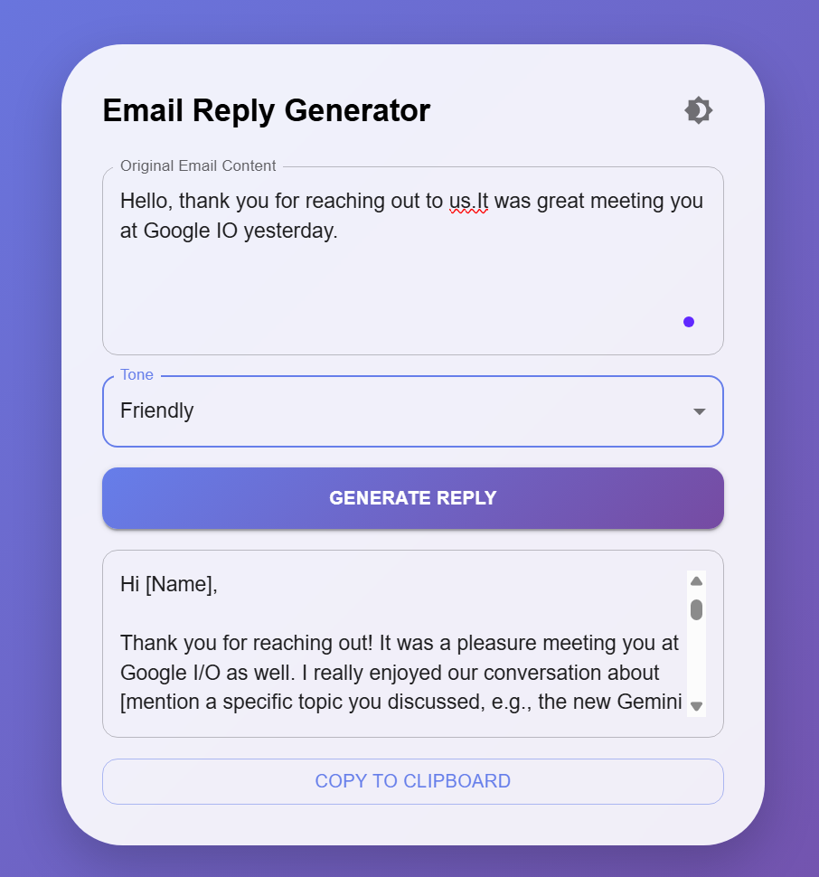
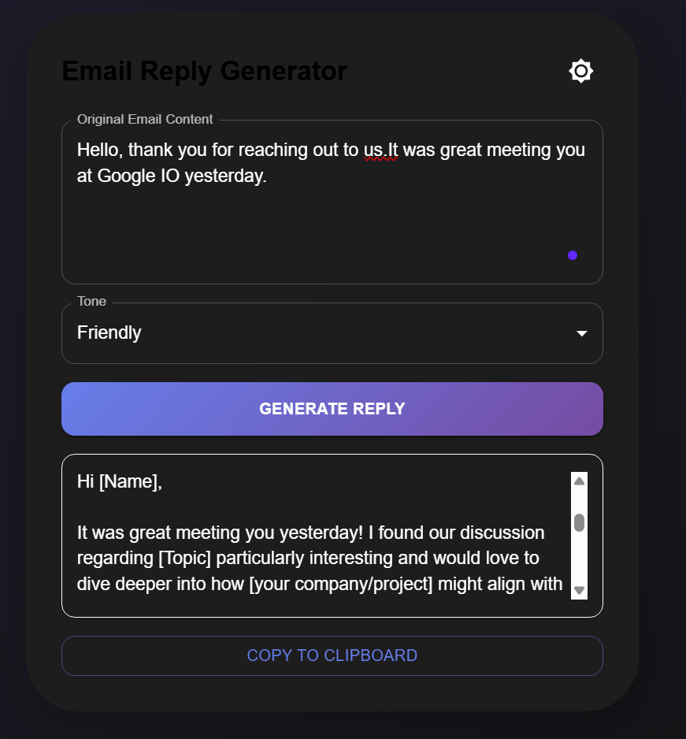
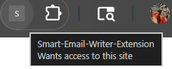
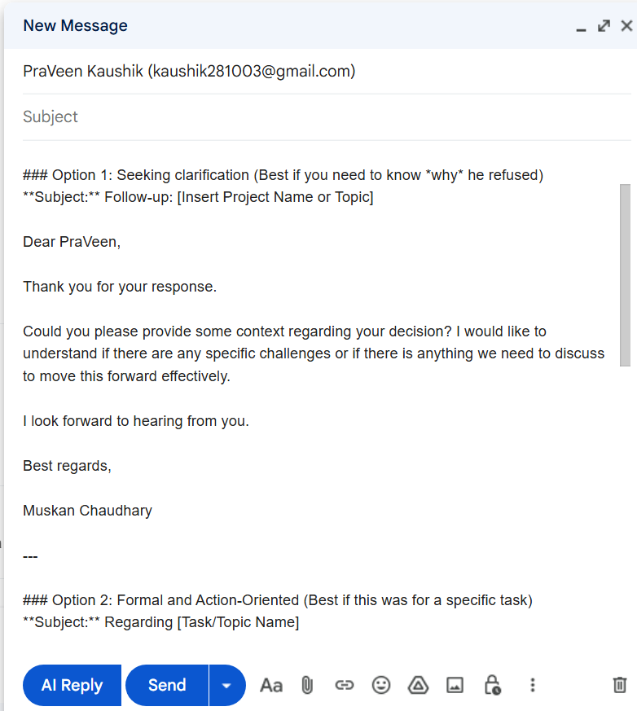
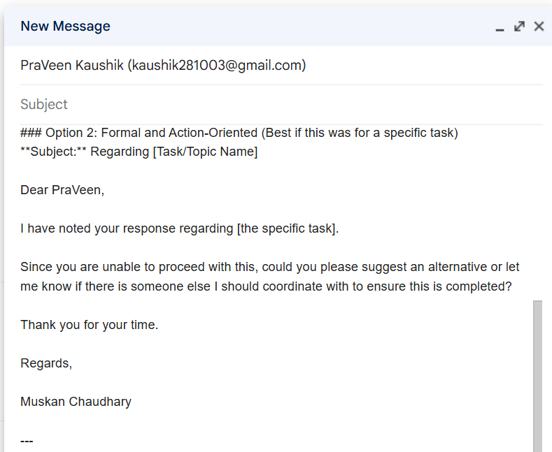

# 🚀 Smart Email Assistant (Chrome Extension)

**Smart Email Assistant** is an AI-powered email generation system that helps users draft professional emails instantly. The project combines a **full-stack web application** with a **Chrome Extension** to enable real-time email generation directly inside Gmail.

This project focuses on real-world usability, seamless integration, and productivity enhancement.

---

## 🔧 Tech Stack

* **Frontend:** HTML, CSS, JavaScript (Vite)
* **Backend:** Spring Boot (Java)
* **AI Integration:** Gemini API
* **Extension:** Chrome Extension APIs (Manifest V3, Content Scripts)
* **Other Tools:** Git, REST APIs

---

## 🚀 Features

* 🤖 **AI Email Generation** – Generate professional emails using Gemini API
* 📩 **Gmail Integration** – Use extension directly inside Gmail
* ⚡ **Real-Time Drafting** – Instantly generate email content
* 🌐 **Full Stack System** – Frontend + Backend integration
* 🔐 **Secure API Handling** – Backend manages AI requests securely

---

## 🎯 Highlights

* Seamless integration with Gmail UI
* Clean and minimal interface for quick email generation
* Designed for productivity and real-world use
* End-to-end working product (Frontend + Backend + Extension)

---

## 📂 Project Structure

```
Smart-Email-Assistant/
│
└── backend/
      ├── frontend/        # HTML, CSS, JS (Vite)
      ├── src/             # Spring Boot source code
      ├── pom.xml          # Maven config
      └── ...
```

> Note: Frontend is managed within backend directory in this setup.

---

## 📸 Screenshots

### 🖥️ Web App UI





### 🧩 Chrome Extension




### 🔥 Gmail Integration








---

## 🔗 Chrome Extension


👉 **Extension Repository:**  
[Smart Email Assistant Extension]https://github.com/MMuusskkaann/smart-email-ai-assistant-extension)

---

## ⚙️ Installation & Setup

### 1️⃣ Clone the repository

```
git clone https://github.com/MMuusskkaann/Smart-Email-Assistant-system.git

```

### 2️⃣ Setup Backend

```
cd backend
mvn spring-boot:run
```

### 3️⃣ Setup Frontend

```
cd frontend
npm install
npm run dev
```

---

## 🔑 Environment Variables

```
GEMINI_API_KEY=your_api_key_here
```

---

## 🎯 Use Case

* Generate emails quickly inside Gmail
* Improve productivity for daily communication
* Reduce manual effort in writing emails

---

## ⭐ Contribute / Feedback

Feel free to fork, contribute, or give feedback!
